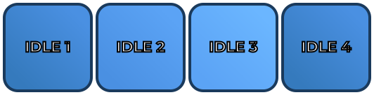
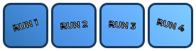

# 2d-assets-mcp

[](https://modelcontextprotocol.io/introduction)
[](https://www.npmjs.com/package/2d-assets-mcp)
[](https://www.npmjs.com/package/2d-assets-mcp)
[](https://opensource.org/licenses/MIT)
[](https://www.typescriptlang.org/)


An **[MCP (Model Context Protocol)](https://modelcontextprotocol.io/) server** that generates advanced mock 2D PNG assets for games prototypes — directly from any MCP-compatible AI client such as Claude Desktop.

This MCP is engine-agnostic and works with any game engine that supports PNG import:
- Godot
- Unity
- Unreal Engine
- GameMaker
- Construct
- RPG Maker
- And many more...

Create placeholder sprites, UI elements, health bars, spritesheets, and more with full support for gradients, patterns, transparency, text rotation, and auto-scaling — all without opening an image editor.

Each generated PNG embeds rich JSON metadata (dimensions, color, shape, gradient properties, pattern details, text properties, stroke properties, description) directly in its EXIF data, so AI models without vision can still understand what an asset contains.

---

## Security Considerations

This MCP server has direct file system access to generate assets. Please review these security implications:

### File System Access

- The server can write files to any path specified by the AI assistant
- **Recommendation:** Configure your AI client to restrict access to specific project directories when possible
- **Warning:** Be cautious when asking the AI to generate assets outside your project directory

### Path Traversal

- The server validates paths but you should still be aware of potential path traversal attempts
- Always review generated file paths before confirming operations

### Asset Content

- Generated assets are placeholder graphics and contain no malicious code
- Embedded metadata is plain JSON and does not execute code

### Best Practices

- Use absolute paths in configurations to prevent ambiguity
- Restrict AI access to your game project directory only
- Review generated assets before committing to version control
- Keep your Node.js dependencies updated

---

## Features

- **Single asset generation** — one tool call, one PNG, full visual configuration
- **Batch + spritesheet mode** — generate multiple assets or composite them into a single animation-strip spritesheet in one request
- **Rich visual options** — solid fills, linear/radial gradients, stripe/dot/grid pattern overlays, rounded corners, circles, opacity, and border control
- **Progress/health bar fills** — `fillPercent` + `trackColor` for partially-filled assets
- **Auto-scaling text** — labels fit the asset; override with explicit `fontSize` if needed
- **Embedded JSON metadata** — readable back via `read_image_metadata` without loading image pixels, ideal for non-vision AI workflows
- **Filename dimensions** — output files are named `player_idle_128x128.png` automatically to help models with no vision know the dimensions when using the asset
---

### Generated Assets Examples

Here are some example assets generated by this MCP server:

#### Character Sprites & Animations

**Hero Idle Animation (4 frames, 532×136)**



*4-frame idle animation spritesheet with breathing effect and progressive blue shades*

### UI Elements

**Attack Button (128×48)**


*Button with red gradient, rounded corners, and "ATTACK" label*

**Health Bar (200×24)**


*Health bar at 75% fill with green color and dark gray track*

### Game Items

**Gold Coin (32×32)**


*Circular coin with radial gradient, dot pattern overlay, and "COIN" label*

### Animation Spritesheets

**Player Run Cycle (4 frames, 276×72)**



*4-frame run animation spritesheet with progressive blue shades*

---
## Tools Reference

This MCP server provides 3 tools for generating and reading 2D asset metadata.

### 1. `generate_mock_asset`

Generates a single PNG asset and writes it to disk. Supports gradients, patterns, transparency, text rotation, and embedded metadata.

<details>
<summary><strong>Parameters (click to expand)</strong></summary>

**Required parameters**

| Parameter     | Type     | Description                                             |
|---------------|----------|---------------------------------------------------------|
| `filename`    | `string` | Output filename, e.g. `player_idle.png`                 |
| `directory`   | `string` | Absolute path to the output folder (created if missing) |
| `text`        | `string` | Label rendered on the asset                             |
| `color`       | `string` | Background hex color, e.g. `#FF5733`                    |

**Optional parameters — shape & size**

| Parameter     | Type                                           | Default     | Description                                |
|---------------|------------------------------------------------|-------------|--------------------------------------------|
| `width`       | `number`                                       | `128`       | Width in pixels                            |
| `height`      | `number`                                       | `128`       | Height in pixels                           |
| `shape`       | `rectangle` \| `rounded-rectangle` \| `circle` | `rectangle` | Geometric shape                            |
| `opacity`     | `number` `0–1`                                 | `1.0`       | Background opacity                         |
| `strokeColor` | `string`                                       | `#000000`   | Border hex color                           |
| `strokeWidth` | `number`                                       | `4`         | Border width in px; `0` removes the border |

**Optional parameters — fill & gradient**

| Parameter        | Type                                              | Default      | Description                                                |
|------------------|---------------------------------------------------|--------------|------------------------------------------------------------|
| `fillMode`       | `solid` \| `linear-gradient` \| `radial-gradient` | `solid`      | Background fill type                                       |
| `secondaryColor` | `string`                                          | auto-derived | Second gradient stop; auto-shaded from `color` if omitted  |
| `gradientAngle`  | `number`                                          | `45`         | Angle in degrees for linear gradients (ignored for radial) |

**Optional parameters — progress/health bar**

| Parameter     | Type             | Default | Description                                           |
|---------------|------------------|---------|-------------------------------------------------------|
| `fillPercent` | `number` `0–100` | `100`   | How much of the asset is filled (left to right)       |
| `trackColor`  | `string`         |    —    | Color of the unfilled portion; transparent if omitted |

**Optional parameters — pattern overlay**

| Parameter        | Type                                    | Default           | Description                             |
|------------------|-----------------------------------------|-------------------|-----------------------------------------|
| `pattern`        | `none` \| `stripes` \| `dots` \| `grid` | `none`            | Pattern overlay type                    |
| `patternColor`   | `string`                                | auto-derived      | Pattern color; contrast-auto if omitted |
| `patternOpacity` | `number` `0–1`                          | `0.18`            | Pattern overlay opacity                 |
| `patternScale`   | `number` `≥2`                           | `16`              | Pattern tile size in pixels             |

**Optional parameters — text**

| Parameter        | Type                            | Default           | Description                                    |
|------------------|---------------------------------|-------------------|------------------------------------------------|
| `textPosition`   | `center` \| `top` \| `bottom`   | `center`          | Vertical text alignment                        |
| `fontSize`       | `number`                        | auto-scaled       | Explicit font size in px; auto-fits if omitted |
| `textRotation`   | `number`                        | `0`               | Text rotation angle in degrees                 |

**Optional parameters — metadata**

| Parameter          | Type     | Default | Description                                                                   |
|--------------------|----------|---------|-------------------------------------------------------------------------------|
| `assetDescription` | `string` | —       | Human-readable description embedded in the PNG EXIF for non-vision AI context |

</details>

**Output filename format**

The server automatically appends the dimensions to the filename before writing:

```
player_idle.png  →  player_idle_128x128.png
```

---

### 2. `generate_mock_asset_batch`

Generates multiple assets in one request. Supports individual PNGs or a single composed spritesheet.

<details>
<summary><strong>Parameters (click to expand)</strong></summary>

**Required parameters**

| Parameter | Type            | Description                                                   |
|-----------|-----------------|---------------------------------------------------------------|
| `assets`  | `AssetConfig[]` | Array of asset configs (same fields as `generate_mock_asset`) |

**Optional parameters**

| Parameter         | Type                         | Default                 | Description                                                            |
|-------------------|------------------------------|-------------------------|------------------------------------------------------------------------|
| `spritesheetMode` | `individual` \ `spritesheet` | `spritesheet`           | `individual` writes separate PNGs; `spritesheet` composes a single PNG |
| `sheetFilename`   | `string`                     | `spritesheet.png`       | Output filename for the spritesheet                                    |
| `sheetDirectory`  | `string`                     | first asset's directory | Output directory for the spritesheet                                   |
| `sheetMargin`     | `number`                     | `8`                     | Outer padding around the spritesheet in pixels                         |
| `sheetSpacing`    | `number`                     | `8`                     | Gap between frames in pixels                                           |

</details>

**Spritesheet layout**

All assets are arranged in a single row (traditional animation strip). Each frame cell is sized to the largest asset in the batch; smaller assets are centered within their cell. The output filename includes the total sheet dimensions:

```
player_run.png  →  player_run_648x136.png
```

---

### 3. `read_image_metadata`

Reads the JSON metadata embedded in the EXIF `ImageDescription` field of any PNG generated by this server. Useful for AI models that lack vision — they can understand what an asset contains without decoding the image.

<details>
<summary><strong>Parameters (click to expand)</strong></summary>

**Required parameters**

| Parameter  | Type     | Description                     |
|------------|----------|---------------------------------|
| `filepath` | `string` | Absolute path to the PNG file   |

</details>

**How metadata embedding works**

Metadata is stored as a JSON string in the PNG's EXIF `IFD0.ImageDescription` field using the `sharp` library's `withMetadata` API.

Reading it back uses a deliberate bypass of standard TIFF byte-walking: instead of parsing the binary TIFF structure, the raw EXIF buffer is scanned as a UTF-8 string for the known `"generator":"2d-assets-mcp"` key, then the surrounding JSON object is extracted. This makes the reader immune to TIFF padding, byte-order variations, and unusual IFD layouts across different PNG writers.

**Example response**

```json
{
  "generator": "2d-assets-mcp",
  "type": "asset",
  "name": "player_idle",
  "width": 128,
  "height": 128,
  "color": "#4A90E2",
  "shape": "rounded-rectangle",
  "fillMode": "linear-gradient",
  "fillPercent": 100,
  "trackColor": null,
  "pattern": "none",
  "secondaryColor": "#2E5A8A",
  "gradientAngle": 45,
  "textRotation": 0,
  "textPosition": "center",
  "strokeColor": "#000000",
  "strokeWidth": 4,
  "description": "Player idle placeholder, blue rounded rectangle 128x128",
  "createdAt": "2025-01-15T10:30:00.000Z"
}
```

**Spritesheet metadata fields** (additional fields returned for spritesheet files)

```json
{
  "generator": "2d-assets-mcp",
  "type": "spritesheet",
  "totalWidth": 648,
  "totalHeight": 136,
  "columns": 4,
  "rows": 1,
  "frameCount": 4,
  "frameWidth": 128,
  "frameHeight": 128,
  "margin": 8,
  "spacing": 8,
  "frames": [
    {
      "index": 0,
      "x": 8,
      "y": 8,
      "width": 128,
      "height": 128,
      "name": "frame_0",
      "color": "#4A90E2",
      "shape": "rounded-rectangle"
    }
  ],
  "createdAt": "2025-01-15T10:30:00.000Z"
}
```

---

## Usage Examples

Below are example prompts you can give Claude Desktop once the server is connected.

**Single asset**
> "Create a 128×128 blue rounded-rectangle placeholder for my player character at `C:\Users\me\project\assets\sprites\` (Windows) or `/home/me/project/assets/sprites/` (Linux) or `/Users/me/project/assets/sprites/` (macOS). Label it 'Player' and give it a radial gradient."

**Health bar**
> "Generate a health bar PNG at 200×24 pixels, filled 65%, red fill color, dark gray track, at your project's UI folder. Call the file `health_bar.png`."

**Spritesheet**
> "Create a 4-frame run cycle spritesheet for my player. Each frame should be 64×64, different shades of blue, labeled Frame 1 through Frame 4. Save it to your project's sprites folder."

**Read metadata**
> "Read the metadata from your project's sprites folder, file `player_idle_128x128.png`."

---

## Installation

### Option 1 — Use directly with `npx` (no install required)

The fastest way to connect it to Claude Desktop:

```json
{
  "mcpServers": {
    "2d-assets": {
      "command": "npx",
      "args": ["-y", "2d-assets-mcp"]
    }
  }
}
```
### Option 2 — Manual installation with package manager (npm, pnpm, yarn)

```bash
git clone https://github.com/crony-io/2d-assets-mcp.git
cd 2d-assets-mcp

# Choose your package manager:
pnpm install   # recommended
# or
npm install
# or
yarn install

# build
pnpm run build
# or
npm run build
# or
yarn run build
```


### Option 3 — Install globally with npm or pnpm

This project works with any Node.js package manager. Choose your preferred one:

**npm**
```bash
npm install -g 2d-assets-mcp
```

**pnpm**
```bash
pnpm add -g 2d-assets-mcp
```

Then reference the installed binary:

```json
{
  "mcpServers": {
    "2d-assets": {
      "command": "2d-assets-mcp"
    }
  }
}
```

### Claude Code

Add to your Claude Code MCP settings:

```json
{
  "mcpServers": {
    "2d-assets-mcp": {
      "command": "node",
      "args": ["/absolute/path/to/2d-assets-mcp/dist/index.js"]
    }
  }
}
```

### Devin

Add to your Devin MCP settings (`mcp_config.json`):

```json
{
  "mcpServers": {
    "2d-assets-mcp": {
      "command": "node",
      "args": ["/absolute/path/to/2d-assets-mcp/dist/index.js"],
      "disabled": false
    }
  }
}
```

### Cursor

Create `.cursor/mcp.json` in your project:

```json
{
  "mcpServers": {
    "2d-assets-mcp": {
      "command": "node",
      "args": ["/absolute/path/to/2d-assets-mcp/dist/index.js"]
    }
  }
}
```

---

## Claude Desktop Configuration

Open your Claude Desktop config file and add the server under `mcpServers`.

**macOS** — `~/Library/Application Support/Claude/claude_desktop_config.json`

**Windows** — `%APPDATA%\Claude\claude_desktop_config.json`

**Linux** — `~/.config/Claude/claude_desktop_config.json`

### Using npx (recommended — always runs latest version)

```json
{
  "mcpServers": {
    "2d-assets": {
      "command": "npx",
      "args": ["-y", "2d-assets-mcp"]
    }
  }
}
```

### Using a global install

```json
{
  "mcpServers": {
    "2d-assets": {
      "command": "2d-assets-mcp"
    }
  }
}
```

---

## Development

### Prerequisites

- Node.js 18 or later
- npm 9 or later **or** pnpm 8 or later (any package manager works)

### Setup

```bash
git clone https://github.com/crony-io/2d-assets-mcp.git
cd 2d-assets-mcp
# Choose your package manager:
pnpm install   # recommended
# or
npm install
# or
yarn install
```

### Scripts

| Command                                    | Description                                           |
|--------------------------------------------|-------------------------------------------------------|
| `npm run build` / `pnpm run build`         | Compile TypeScript to `dist/`                         |
| `npm run dev` / `pnpm run dev`             | Run directly from source with `tsx` (no build needed) |
| `npm run start` / `pnpm run start`         | Run the compiled server from `dist/`                  |
| `npm run typecheck` / `pnpm run typecheck` | Type-check without emitting files                     |
| `npm run check` / `pnpm run check`         | Run all checks: format, lint, and typecheck           |

---

### Adding a new tool

1. Create `src/tools/yourTool.ts` and export a `registerYourTool(server: McpServer)` function
2. Import and call it in `src/server.ts`
3. Add any new Zod schemas to `src/schemas.ts` and types to `src/types.ts`

---

## License

MIT — see [LICENSE](LICENSE) for full text.

---

## Contributing

Issues and pull requests are welcome. Before opening a PR:

1. Run `npm run check` or `pnpm run check` — zero errors required
2. Keep new tools in their own file under `src/tools/`
3. Export new types from `src/types.ts` and schemas from `src/schemas.ts`
4. Update this README's **Tools Reference** section for any new or changed parameters